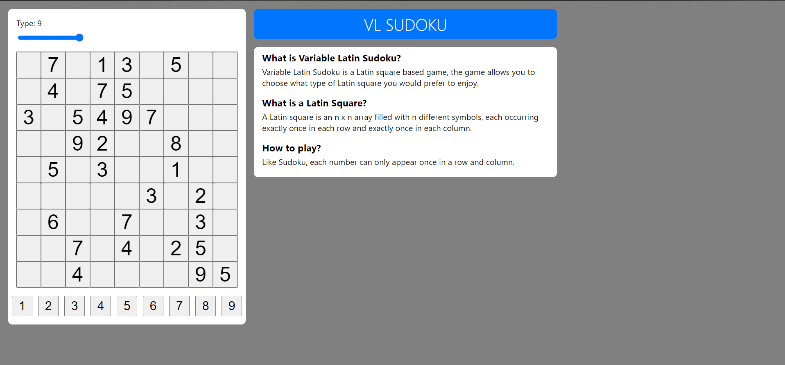

<!-- PROJECT LOGO -->
<br />
<div align="center">

<h3 align="center">VL Sudoku</h3>

  <p align="center">
    Variable Latin Sudoku is a Latin square based game, the game allows you to choose what type of Latin square you would prefer to enjoy.
    <br />
    <a href="https://github.com/slickLink/VL-Sudoku"><strong>Explore the docs »</strong></a>
    <br />
    <br />
    <a href="https://v-sudoku.netlify.app/">View Live Demo</a>
    ·
    <a href="hhttps://github.com/slickLink/VL-Sudoku/issues">Report Bug</a>
    ·
    <a href="https://github.com/slickLink/VL-Sudoku/issues">Request Feature</a>
  </p>
</div>


<!-- TABLE OF CONTENTS -->
<details>
  <summary>Table of Contents</summary>
  <ol>
    <li>
      <a href="#about-the-project">About The Project</a>
      <ul>
        <li><a href="#built-with">Built With</a></li>
      </ul>
    </li>
    <li>
      <a href="#getting-started">Getting Started</a>
      <ul>
        <li><a href="#prerequisites">Prerequisites</a></li>
        <li><a href="#installation">Installation</a></li>
      </ul>
    </li>
    <li><a href="#license">License</a></li>
    <li><a href="#contact">Contact</a></li>
    <li><a href="#acknowledgments">Acknowledgments</a></li>
  </ol>
</details>

<!-- ABOUT THE PROJECT -->
## About The Project


Created this project after learning sudoku is a latin square, I wanted to create a variable version accessible over the internet when i'm bored and dont feel like playing sudoku at the moment. Hence VL SUDOKU was born.

<p align="right">(<a href="#top">back to top</a>)</p>

### Built With

* [React.js](https://reactjs.org/)
* [HTML](https://html.com/)
* [CSS](https://www.w3.org/Style/CSS/Overview.en.html)

<p align="right">(<a href="#top">back to top</a>)</p>

<!-- GETTING STARTED -->
## Getting Started

To get a local copy up and running follow these simple example steps.

### Prerequisites

* npm
  ```sh
  npm install npm@latest -g
  ```

### Installation
1. Clone the repo
   ```sh
   git clone https://github.com/slickLink/VL-Sudoku.git
   ```
3. Install NPM packages
   ```sh
   npm install
   ```
4. Run locally
    ```sh
    npm start
    ```

<p align="right">(<a href="#top">back to top</a>)</p>

<!-- LICENSE -->
## License

Distributed under the GNU GENERAL PUBLIC LICENSE. See `LICENSE.txt` for more information.

<p align="right">(<a href="#top">back to top</a>)</p>

<!-- CONTACT -->
## Contact

Lincoln Dube  - lincoln.dube@outlook.com

Project Link: [https://github.com/slickLink/VL-Sudoku](https://github.com/slickLink/VL-Sudoku)

<p align="right">(<a href="#top">back to top</a>)</p>

<!-- ACKNOWLEDGMENTS -->
## Acknowledgments

* [JAMES V. BRADLEY](https://www.jstor.org/stable/2281872)
* [OTHNEIL DREW](https://github.com/othneildrew/Best-README-Template)

<p align="right">(<a href="#top">back to top</a>)</p>